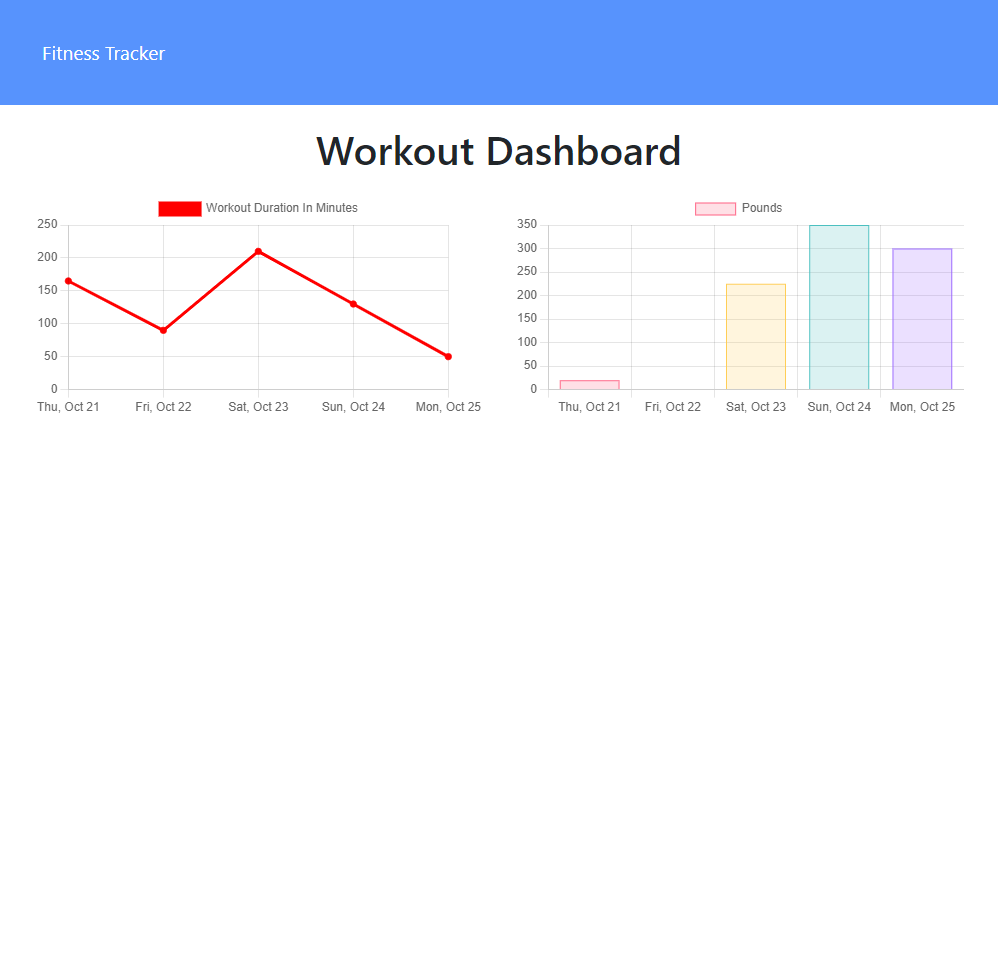

# Workout-Tracker
  
  
  
  ## Description
  A simple web app that allows the user to keep track of exercises they complete as part of each workout. They can review the overall stats for the previous 7 days' workouts that they have completed.

  

  ## Table of Contents
  * [Installation](#installation)
  * [Usage](#usage)
  * [Contributing](#contributing)
  * [Tests](#tests)
  * [License](#license)
  * [Questions](#questions)
  
  ## Installation
  Clone the repo, install the dependencies. You can then run the server locally with "node server.js". Note that there is also some seed data that you can choose to utilize if you would like, but it is not necessary. 

  ## Usage
  Runs as express server with mongodb. You may use it locally or deploy with mongodb Atlas.
  [Link to Live Deployment:](https://shrouded-fjord-56938.herokuapp.com/)  

  ## Contributing
  None at this time. Thanks

  ## Tests
  No Tests

  ## License
  MIT License
  

  ## Questions
  If you have questions, you can reach me via Github:
  [irv0735](https://github.com/irv0735)

  Or contact via email:
  irv0735@gmail.com

